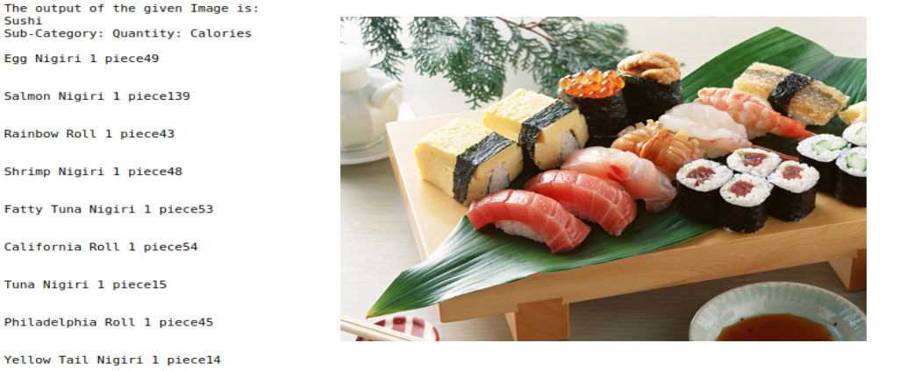

# Food Lens

Its basically a Food Classifier for multiclass classification, which can detect around 500 classes of food and their subclasses. It also provides information regarding calories for that particular food item and their sub-class items. 

